# ENTITY-RELATIONSHIP DIAGRAM (ERD)

## Виртуальный консультант по питанию

**Закрывает:** roadmap **0.4** (проектирование ERD с привязкой `NutritionDiary` и `Report` к `ClientEnrollment`).
**Источник модели:** `Domain_Analysis_v2.md` (раздел 2, 4, 6), `adminAPI.md` (§3 — `EnrollmentLink`, `EnrollmentLinkAttempt`).
**Связанные документы:** `Functional_Requirements.md`, `nonFR.md`, `CJM.md`.

---

## 1. Ключевое проектное решение (суть шага 0.4)

Согласно `Domain_Analysis_v2.md` п.3.1, при продлении курса (ФТ-18) у клиента появляется **несколько** `ClientEnrollment`. Чтобы корректно разделять данные по периодам участия (итоговый отчёт ФТ-14, архивирование ФТ-23, история для AI-анализа), «периодные» сущности привязаны **к `ClientEnrollment`**, а не напрямую к `Client`:

- `ClientEnrollment (1) → (M) NutritionDiary`
- `ClientEnrollment (1) → (M) Report`
- `ClientEnrollment (1) → (M) Progress`
- `ClientEnrollment (1) → (1) Goal` (персональный экземпляр цели на период)

Связь этих сущностей с `Client` сохраняется как денормализованный «быстрый» доступ (для выборок в admin API), но **owning-связь — через `ClientEnrollment`**. FK `clientEnrollmentId` — обязательный (NOT NULL); `clientId` — производный и должен совпадать с `clientEnrollment.clientId`.

---

## 2. ERD (Mermaid)

> Диаграмма рендерится в GitHub, Cursor и большинстве Markdown-просмотрщиков.
> `PK` — первичный ключ, `FK` — внешний ключ. Enum-значения указаны в кавычках комментарием.

```mermaid
erDiagram
    CLIENT ||--o{ CLIENT_ENROLLMENT : "1 → M"
    COURSE ||--o{ CLIENT_ENROLLMENT : "1 → M"
    COURSE ||--o{ GOAL_TEMPLATE : "1 → M (каталог целей)"

    CLIENT ||--|| NOTIFICATION_SETTINGS : "1 → 1"
    CLIENT ||--o{ HABIT : "1 → M"

    CLIENT_ENROLLMENT ||--|| GOAL : "1 → 1 (персональный экземпляр)"
    GOAL_TEMPLATE ||--o{ GOAL : "1 → M (создаётся из шаблона)"

    CLIENT_ENROLLMENT ||--o{ ENROLLMENT_LINK : "1 → M"
    ENROLLMENT_LINK ||--o{ ENROLLMENT_LINK_ATTEMPT : "1 → M"

    CLIENT_ENROLLMENT ||--o{ NUTRITION_DIARY : "1 → M (шаг 0.4)"
    CLIENT_ENROLLMENT ||--o{ REPORT : "1 → M (шаг 0.4)"
    CLIENT_ENROLLMENT ||--o{ PROGRESS : "1 → M"
    CLIENT_ENROLLMENT ||--o{ QUESTIONNAIRE : "1 → M"
    CLIENT_ENROLLMENT ||--o{ RENEWAL_OFFER : "1 → M (roadmap 8)"

    CLIENT ||--o{ NUTRITION_DIARY : "1 → M (denorm)"
    CLIENT ||--o{ REPORT : "1 → M (denorm)"
    CLIENT ||--o{ PROGRESS : "1 → M (denorm)"
    CLIENT ||--o{ QUESTIONNAIRE : "1 → M (denorm)"
    CLIENT ||--o{ RECOMMENDATION : "1 → M"
    CLIENT ||--o{ MESSAGE : "1 → M"
    CLIENT ||--o{ REMINDER : "1 → M"
    CLIENT ||--o{ FEEDBACK : "1 → M"
    CLIENT ||--o{ RENEWAL_OFFER : "1 → M (denorm, roadmap 8)"

    NUTRITION_DIARY ||--o{ RECOMMENDATION : "1 → M (анализ записи)"
    QUESTIONNAIRE ||--o{ RECOMMENDATION : "1 → M (анализ анкеты)"

    RECOMMENDATION ||--o{ FEEDBACK : "1 → M"
    RECOMMENDATION ||--o{ MESSAGE : "1 → M (доставка)"

    GOAL ||--o{ PROGRESS : "1 → M"

    CLIENT {
        uuid id PK
        string firstName
        string lastName
        bigint telegramId "nullable, до активации ссылки"
        string telegramUsername "nullable"
        string email "nullable"
        string phone "nullable, unique"
        timestamp registeredAt
        timestamp lastInteractionAt "nullable, ФТ-9/ФТ-11"
    }

    COURSE {
        uuid id PK
        string name
        int durationDays
        date startDate
        date endDate
    }

    GOAL_TEMPLATE {
        uuid id PK
        uuid courseId FK
        string type "weight_loss|muscle_gain|metabolism|health"
        string description
    }

    CLIENT_ENROLLMENT {
        uuid id PK
        uuid clientId FK
        uuid courseId FK
        date startDate
        date endDate "плановая"
        string status "active|paused|completed|cancelled"
        string onboardingStatus "pending|in_progress|settings_pending|completed"
    }

    GOAL {
        uuid id PK
        uuid clientEnrollmentId FK
        uuid goalTemplateId FK
        string targetMetrics "например -10 кг"
        string baselineMetrics "исходный вес/объёмы"
        string timeHorizon
    }

    ENROLLMENT_LINK {
        uuid id PK
        uuid enrollmentId FK
        string code "уникальный, без префикса enr_"
        timestamp createdAt
        timestamp expiresAt "createdAt + 7 дней"
        timestamp usedAt "nullable"
        bigint usedByTelegramId "nullable"
        timestamp revokedAt "nullable"
        string status "active|used|expired|revoked"
    }

    ENROLLMENT_LINK_ATTEMPT {
        uuid id PK
        uuid linkId FK
        timestamp attemptedAt
        bigint telegramId "nullable"
        string result "success|expired|already_used|invalid_code|enrollment_cancelled"
    }

    NUTRITION_DIARY {
        uuid id PK
        uuid clientEnrollmentId FK "owning, NOT NULL — шаг 0.4"
        uuid clientId FK "denorm"
        timestamp mealAt "автоопределение или текущее время"
        text description
        int approxCalories "nullable"
        boolean hasPhoto
        string photoRef "nullable, encrypted storage"
        string status "filled|pending|needs_clarification"
        timestamp createdAt
    }

    HABIT {
        uuid id PK
        uuid clientId FK
        string description
        string status "active|inactive"
        string frequency "daily|weekdays|custom"
    }

    NOTIFICATION_SETTINGS {
        uuid id PK
        uuid clientId FK "unique 1:1"
        string reminderTime "HH:mm"
        string frequency "daily|every_other_day|three_per_week|custom_days"
        string enabledTypes "diary|recommendations|weekly_report (набор)"
        string timezone "IANA, default Europe/Moscow"
        boolean enabled
        string disabledReason "nullable: user_request|inactivity"
    }

    QUESTIONNAIRE {
        uuid id PK
        uuid clientEnrollmentId FK
        uuid clientId FK "denorm"
        json answers
        int currentQuestion
        string status "in_progress|completed"
        timestamp lastAnswerAt "nullable"
        timestamp lastReminderAt "nullable"
        timestamp completedAt "nullable"
        json analysisResult "nullable"
    }

    RECOMMENDATION {
        uuid id PK
        uuid clientId FK
        uuid nutritionDiaryId FK "nullable, взаимоисключающе с questionnaireId"
        uuid questionnaireId FK "nullable"
        string type "product|habit|regimen|calories"
        string priority "critical|high|medium|low"
        text content "nullable, текст рекомендации"
        string status "sent|read|applied|dismissed"
        timestamp createdAt
    }

    MESSAGE {
        uuid id PK
        uuid clientId FK
        uuid recommendationId FK "nullable"
        string type "recommendation|reminder|questionnaire_reminder|report|info"
        string category "transactional|optional"
        text content
        string channel "telegram|whatsapp|max"
        string deliveryStatus "sent|delivered|read|delivery_failed"
        int retryCount "0..3"
        timestamp createdAt
    }

    REMINDER {
        uuid id PK
        uuid clientId FK
        string type "fill_diary|check_recommendation"
        string schedule "время отправки"
        string status "active|inactive|done"
    }

    FEEDBACK {
        uuid id PK
        uuid clientId FK
        uuid recommendationId FK
        int rating "1..5"
        text comment "nullable, обязателен при 1-3"
        boolean isApplied "nullable"
        timestamp createdAt
    }

    RENEWAL_OFFER {
        uuid id PK
        uuid clientId FK "denorm"
        uuid enrollmentId FK "owning, NOT NULL — roadmap 8"
        string status "sent|clicked|converted|dismissed"
        text checkoutUrl
        int basePrice "копейки"
        int discountPercent "0..100"
        int finalPrice "копейки"
        timestamp offeredAt
        timestamp clickedAt "nullable"
        timestamp updatedAt
    }

    REPORT {
        uuid id PK
        uuid clientEnrollmentId FK "owning, NOT NULL — шаг 0.4"
        uuid clientId FK "denorm"
        date periodStart
        date periodEnd
        string type "weekly|monthly|final"
        json diaryStats "avg calories, БЖУ"
        int adherencePercent
        json problemAreas
        json dynamics "сравнение с прошлым периодом"
        timestamp createdAt
    }

    PROGRESS {
        uuid id PK
        uuid clientEnrollmentId FK "owning, NOT NULL"
        uuid clientId FK "denorm"
        uuid goalId FK
        timestamp measuredAt
        json metrics "вес, объёмы, самочувствие"
        int achievementPercent
        text comment "nullable"
    }
```

> Примечание: `AI_MODEL_LOG` (см. `Domain_Analysis_v2.md`) — самостоятельная сущность без внешних связей с клиентскими данными (журнал версий промпта/модели, roadmap 11.5), поэтому в ERD связей не имеет и в диаграмму не включена. Отдельно фиксируется как операционная таблица: `id, version, updatedAt, updateReason, analystComment`.

---

## 3. Легенда кардинальностей (нотация Crow's Foot / Mermaid)

| Символ | Значение |
|--------|----------|
| `\|\|` | ровно один (1) |
| `o{` | ноль или много (0..M) |
| `\|{` | один или много (1..M) |
| `\|\|--\|\|` | связь один-к-одному |
| `\|\|--o{` | связь один-ко-многим (сторона «многие» опциональна) |

---

## 4. Таблица связей и обоснование

| Родитель | Кардинальность | Потомок | Обоснование |
|----------|----------------|---------|-------------|
| Client | 1 → M | ClientEnrollment | клиент может проходить курс повторно (ФТ-18) |
| Course | 1 → M | ClientEnrollment | на один курс записано много клиентов |
| Course | 1 → M | GoalTemplate | курс хранит каталог доступных целей (п.3.1) |
| GoalTemplate | 1 → M | Goal | персональный экземпляр создаётся из шаблона |
| ClientEnrollment | 1 → 1 | Goal | персональная цель на конкретный период (п.3.1) |
| ClientEnrollment | 1 → M | EnrollmentLink | несколько ссылок за счёт regenerate (не более 1 `active`, правило 9) |
| EnrollmentLink | 1 → M | EnrollmentLinkAttempt | лог попыток активации (ФТ-1) |
| **ClientEnrollment** | **1 → M** | **NutritionDiary** | **разделение записей по периодам участия (шаг 0.4, п.3.1)** |
| **ClientEnrollment** | **1 → M** | **Report** | **отчёт за конкретный enrollment; при продлении их несколько (шаг 0.4, ФТ-14, ФТ-23)** |
| ClientEnrollment | 1 → M | Progress | замеры относятся к периоду и его цели |
| ClientEnrollment | 1 → M | Questionnaire | анкета проходится в рамках подключения к курсу (ФТ-2) |
| Client | 1 → 1 | NotificationSettings | инициализируется при создании клиента (правило 3) |
| Client | 1 → M | Habit / Recommendation / Message / Reminder / Feedback | сквозные для клиента сущности |
| ClientEnrollment | 1 → M | RenewalOffer | предложение продления за конкретный enrollment (roadmap 8, ФТ-18) |
| Client | 1 → M | RenewalOffer | денормализованная копия для выборок администратора (roadmap 8) |
| NutritionDiary | 1 → M | Recommendation | рекомендация на основе анализа записи (правило 1) |
| Questionnaire | 1 → M | Recommendation | рекомендация на основе анализа анкеты (правило 1) |
| Recommendation | 1 → M | Feedback | оценка полезности рекомендации (ФТ-15/16) |
| Recommendation | 1 → M | Message | доставка рекомендации в Telegram |
| Goal | 1 → M | Progress | прогресс измеряется относительно цели |

---

## 5. Ключевые ограничения целостности

1. `NutritionDiary.clientEnrollmentId` и `Report.clientEnrollmentId` — **NOT NULL**; `clientId` обязан совпадать с `clientEnrollment.clientId` (проверяется на уровне приложения/триггера).
2. `Recommendation` создаётся только при заполненном **ровно одном** из `nutritionDiaryId` / `questionnaireId` (правило 1; CHECK-constraint `num_nonnull(...) = 1`).
3. `Progress` создаётся только для `ClientEnrollment.status = 'active'` (правило 2).
4. `Feedback` создаётся не позднее 24 ч после `Recommendation.createdAt` (правило 4, контроль на уровне приложения).
5. Не более одной `EnrollmentLink` со `status = 'active'` на один `ClientEnrollment` (правило 9; partial unique index `WHERE status='active'`).
6. `Message.category = 'transactional'` (итоговый отчёт, запрос обратной связи) **не блокируется** отключением уведомлений по ФТ-12 (Domain §3).
7. `NotificationSettings.disabledReason` заполняется только при `enabled = false`.

---

## 6. MVP-подмножество (roadmap 0.3)

Для MVP обязательны сущности: `Client`, `Course`, `ClientEnrollment`, `EnrollmentLink`, `NotificationSettings`, `Questionnaire`, `NutritionDiary`, `Message`, `Recommendation`, `Report`, `Feedback`.

Реализуются следующими инкрементами (не входят в MVP из списка 0.3): `GoalTemplate`, `Goal`, `Progress`, `Habit`, `Reminder`, `EnrollmentLinkAttempt` (лог — желателен уже в MVP по ФТ-1), `AIModelLog`.

---

## 7. Допущения и открытые вопросы

| # | Вопрос | Принятое допущение в ERD |
|---|--------|--------------------------|
| 1 | `NotificationSettings` привязаны к `Client` (1:1), а не к `ClientEnrollment` | следуем `Domain_Analysis_v2.md`; для MVP у клиента один активный enrollment, конфликта нет. При параллельных enrollment — вынести в отдельный инкремент |
| 2 | `Reminder` и `Message` частично пересекаются функционально (Domain §3.2) | `Reminder` — правило расписания, `Message` — факт доставки; связь между ними в MVP не обязательна |
| 3 | Хранение `photoRef` дневника | ссылка на зашифрованное хранилище (roadmap 11.1), сам файл вне БД |
| 4 | Тип `answers`/`analysisResult`/`metrics` | `json`/`jsonb` (PostgreSQL) как гибкая структура до стабилизации схемы |

> Если по п.1 (часовой пояс/множественные enrollment и настройки уведомлений) появятся требования параллельных активных курсов — модель `NotificationSettings` потребует пересмотра на связь с `ClientEnrollment`.
